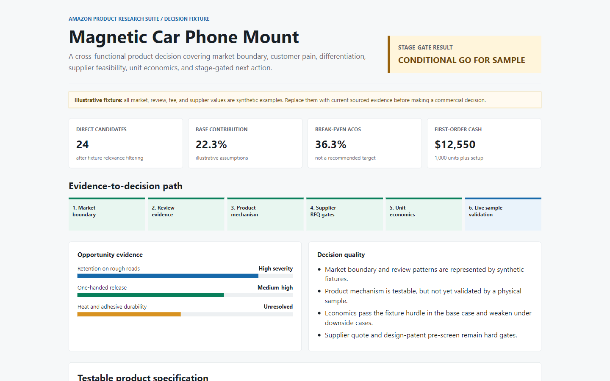

# Amazon 产品研究 Agent Skills

把 Amazon 市场、评论、产品、供应商和成本证据，转成可审计的打样或 Go/No-Go 决策。

[](https://github.com/PDBen-Auto/amazon-product-research-agent-skills/releases/latest)
[](https://github.com/PDBen-Auto/amazon-product-research-agent-skills/releases)
[](https://github.com/PDBen-Auto/amazon-product-research-agent-skills/actions/workflows/validate.yml)

**1 个路由器、7 个专业 Skill、统一证据契约和一条完整决策链。** 单一问题使用专业 Skill；当问题跨越市场、用户、研发、外观风险、供应链、财务和阶段门时，使用统一路由器。

[下载最新 ZIP](https://github.com/PDBen-Auto/amazon-product-research-agent-skills/releases/latest/download/amazon-product-research-agent-skills-v0.1.1.zip) · [在线查看完整 HTML 案例](https://pdben-auto.github.io/amazon-product-research-agent-skills/examples/magnetic-car-phone-mount/decision-report.html) · [English](README.md)



> 图片来自公开演示数据，用于展示工作流和输出契约，不代表实时 Amazon 市场结论。

## 解决什么问题

大多数工具只能回答其中一段：市场工具说明需求，评论分析说明痛点，成本表说明毛利。但产品经理最终需要判断的是：同一个产品是否有明确差异、是否可生产、是否赚钱，以及是否值得进入下一阶段。

```text
市场边界 -> 用户证据 -> 差异化规格 -> 设计/IP 预筛
  -> 供应链可行性 -> 单位经济与现金 -> 打样或 Go/No-Go
```

## 一分钟安装

安装跨模块路由器：

```bash
npx skills add PDBen-Auto/amazon-product-research-agent-skills --skill amazon-product-research-suite
```

检查仓库是否正确暴露 4 个内置 Skill：

```bash
npx skills add PDBen-Auto/amazon-product-research-agent-skills --list
```

然后输入：

```text
使用 $amazon-product-research-suite 评估这个 Amazon US 产品。
只路由会影响决策的工作，先列出缺失证据和输出计划，
不要在没有授权时进行实时采集。
```

路由器本身不需要 Amazon 登录、Seller Central 账号、API Key 或私有服务。专业 Skill 进行实时采集时，可能需要公开网络、用户授权的导出文件或其文档中明确说明的工具。官方 `skills` CLI 会向 [skills.sh](https://www.skills.sh/docs/faq) 上报匿名汇总安装统计，用于目录排名；设置 `DISABLE_TELEMETRY=1` 可以退出。

## 1 个路由器 + 7 个专业 Skill

| 产品问题 | Skill | 输出 |
| --- | --- | --- |
| 应该运行哪些研究模块，先后顺序是什么？ | `amazon-product-research-suite` | 路由计划、缺失证据、执行顺序、统一证据契约 |
| 真实直接市场由哪些产品组成？ | `sellersprite-bi-market-research` | 候选清单、相关性判断、父 ASIN 去重、覆盖闸门、BI HTML |
| 用户反复抱怨什么？ | `amazon-review-scraper` | 评论原文证据、JSON、Excel、离线 VOC HTML |
| 应该做什么差异化产品？ | `amazon-product-differentiation-rd` | 证据到机制映射、可测规格、实验、淘汰标准 |
| 外观是否接近已有设计权？ | `design-patent-search-and-design-around` | 搜索日志、图纸分析、风险拆分、结构性规避方向 |
| 供应商能否按 MOQ、质量和交期生产？ | `amazon-supplier-feasibility` | RFQ、报价归一化、制造风险、样品验收门槛 |
| 产品能否赚钱，首单需要多少现金？ | `amazon-unit-economics-cashflow` | 贡献毛利、盈亏平衡 ACOS、退货敏感性、首单现金 |
| 应该打样、投入还是停止？ | `amazon-product-decision-gateway` | 证据契约、阶段门状态、正式决策交接 |

三个新模块可以单独安装：

```bash
npx skills add PDBen-Auto/amazon-product-research-agent-skills --skill amazon-product-differentiation-rd
npx skills add PDBen-Auto/amazon-product-research-agent-skills --skill amazon-supplier-feasibility
npx skills add PDBen-Auto/amazon-product-research-agent-skills --skill amazon-unit-economics-cashflow
```

## 核心优势

- **从决策开始**：单一问题只用一个专业 Skill，跨模块问题才使用路由器。
- **证据可以跨 Skill 交接**：保留来源、日期、范围、观察、计算、推断、假设、覆盖率和置信度。
- **差异化能够验证和淘汰**：痛点会转成产品机制、量化规格、实验和预先声明的失败标准。
- **下单前验证供应链**：统一 MOQ、模具、报价口径、交期、质量证据和样品门槛，而不是只比较单价。
- **利润和现金分开计算**：确定性计算器区分单件贡献毛利与首单资金需求。
- **遇到缺证据就停止**：验证码、过期数据、费用缺失、法律不确定性和供应商证据不足都会变成显式阻断。
- **仓库安装器没有隐藏追踪**：`scripts/install_suite.py` 不包含遥测、回调、凭证收集、隐藏提示词或后门；官方 `skills` CLI 的匿名安装统计和退出方式已公开说明。

## 可复现案例

磁吸车载手机支架案例包含产品简报、跨 Skill 路由、证据包、基础与下行情景单位经济，以及无需服务器即可打开的 HTML 决策报告。结论为 `CONDITIONAL_GO_FOR_SAMPLE`：只有在确认当前费用、供应商报价和外观专利预筛后，才进入下一阶段。

```bash
python scripts/validate_artifact.py route-plan examples/magnetic-car-phone-mount/route-plan.json
python scripts/validate_artifact.py evidence-bundle examples/magnetic-car-phone-mount/evidence-bundle.json
python -m unittest discover -s tests -v
```

## 固定版本安装器

可选 Python 安装器下载目录中固定的 Commit 或 Release，而不是随时变化的 `main`。已有本地 Skill 默认不会被覆盖，只有显式使用 `--force` 才会替换。

```bash
python scripts/install_suite.py --list
python scripts/install_suite.py --dry-run
python scripts/install_suite.py --skill unit-economics-cashflow
python scripts/install_suite.py --check
```

## 安全与边界

不要提交 Amazon Cookie、私有导出、供应商联系人、客户数据、API Token、签名私钥或私有 Engine 地址。公开仓库只包含可复用工作流、Schema、演示数据和确定性计算；内部评分权重和专有阈值不公开。

本套件不提供法律意见、认证批准、Amazon 结算数据、供应商履约保证或市场结果保证。仓库采用 source-available 许可，重新分发或商业嵌入前请阅读 [LICENSE](LICENSE)。
